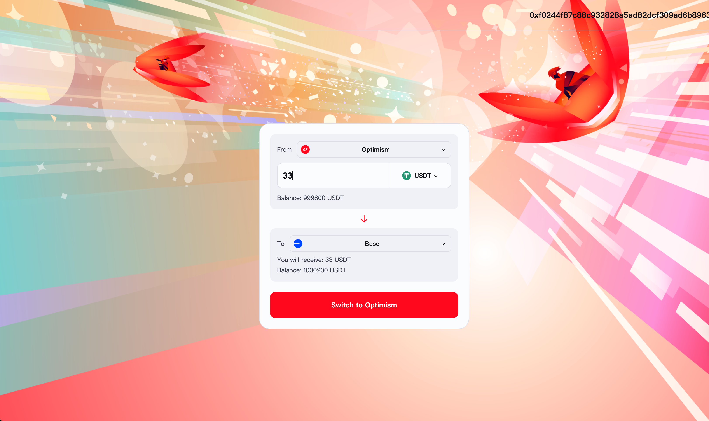

## Project title
Polymer IBC bridge

## Team members
@wulingzhiyi

## Project Overview
Users can cross-chain their USDT assets from Optimism to Base via IBC, and they can also send from Optimism to Base.

## Run-book
1. Install deps
```
just install
```
2. compile smart contract code
```
npx hardhat compile
```
3. deploy bytecode
```
just deploy optimism base
```

2. Then you will got 2 contract address (current portAddress):  
`op: 0x844a848Ed12be1D39518d6706d66Bed24c9d52cA `
`base: 0x844a848Ed12be1D39518d6706d66Bed24c9d52cA`

3. Copy ABI(/artifacts/contracts/PolymerToken.sol/PolymerToken.json) and port address(last step), to frontend project, replace abi.js (ABI), App.vue (contractAddress)
4. run dapp page
```
cd ploymer-frontend-page
```
```
npm install && npm run serve
```
5. See http://localhost:8080/ 
6. Add erc20 token to metamask. op: (port address). base: (port address)


## Resources Used
contract:   @openzeppelin, vibc-core-smart-contracts
frontend:   bignumber.js, vue.js, web3.js
test:       @truffle/hdwallet-provider

## Future Improvements
- Support more ERC-20 tokens
- Support more chains
- Support native token bridge
- Call contract from destination 

## Tx hash
Optimism tx hash: [0xae4057c2e35295f03561154bfb67f5d6a9f1981e7e556ccc938b931a6dce117b](https://optimism-sepolia.blockscout.com/tx/0xae4057c2e35295f03561154bfb67f5d6a9f1981e7e556ccc938b931a6dce117b?tab=index)
Base tx hash: [0x083aab2d8ab6f17e4fab4ee4b18ea9dc887f71c87c660ebd7c97eba8300acbf7](https://base-sepolia.blockscout.com/tx/0x083aab2d8ab6f17e4fab4ee4b18ea9dc887f71c87c660ebd7c97eba8300acbf7?tab=index)


## PortAddress
Op: 0x844a848Ed12be1D39518d6706d66Bed24c9d52cA
Base: 0x844a848Ed12be1D39518d6706d66Bed24c9d52cA



## Licence
[Apache 2.0](LICENSE)


